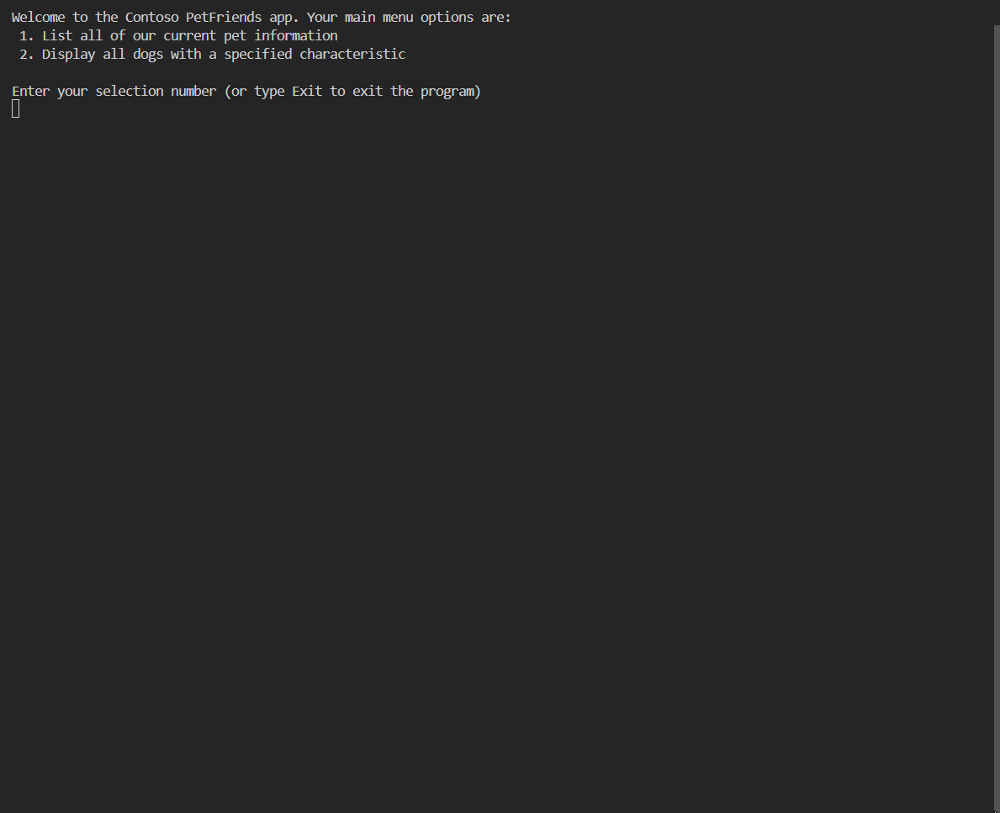

# Project Overview

The objective of this challenge project was to add additional functionality that enabled the Contoso PetFriends App to search through multiple specified tokens and verify whether or not the specified search item exists within our database (multidimensional array). Additionally, we also added an animation to represent that the database search was taking place.

More specifically, this project involved:
- Iterating using data input.
- Processing data.
- Format data output.
- Choosing the correct data types and safely converting data types.
- Creating and manipulating string arrays, and sorting array data.
- Modifying and building complex strings from multiple data sources, and formatting data for display.

<ins>**Source code**</ins>: [here!](FinalProjects/ChallengeProject/Starter/Program.cs)

## Specifications

- **Part I**: Add dog attribute multi-term search
    - Gather user input for the pet characteristic multiple term search
        - Users need to provide search terms separated by commas
        - Store the search terms in an array and sort the terms alphabetically
    - Within the animals array loop that identifies "dogs":
        - Iterate through the search terms to search each dog's description
        - Search the combined description for a term match
        - Output each dog's description where there's one or more terms matched
    - After exiting the "search Animals" array loop that identifies dogs:
        - If no dogs were a match for any of the users provided search terms, output a no dogs matched message.
- **Part II**: Add "search status" improvements
    - Update the animation
        - Adjust the searchingIcons array to resemble a spinning dial
        - Adjust the animation loop so the animation shows a numeric countdown from two to zero (2.., 1.., 0..)

## Sample Output
